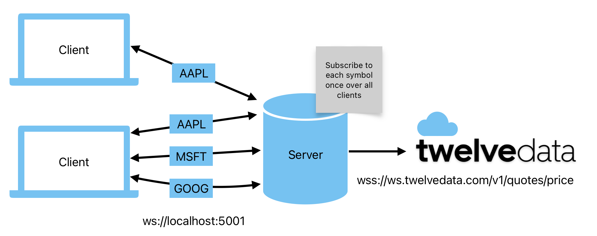

# Stocks App

A simple stock viewer app made to demonstrate familiarity with the following:

- Angular (v18)
  - State management (RxJS, Inputs & Outputs, Signals)
  - Strongly typed components with TypeScript
  - External library integration (TaigaUI & AgCharts, in this case)
  - Basic design principles
- Node.js + Express
- API integration
  - TwelveData for stock data
- Websockets
  - Managing multiple real-time connections
- Data visualization
  - Graphing and charting live time series data

## WebSocket Diagram

WebSocket connections from the client are grouped together on the server side so that only one TwelveData WS connection is used.

